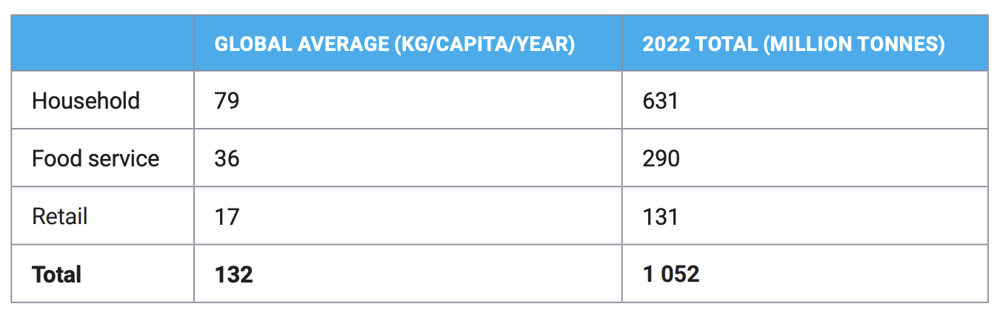
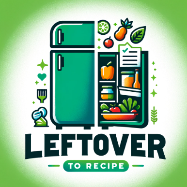

<p align="center">
  🍉 🫒 🥕 🌽 🌶️ 🫑 🥒 🥬 🥦 🧄 🧅 &nbsp;&nbsp;⮕⮕⮕&nbsp;&nbsp;🍜 🍲 🥘 🍛 🥗
</p>

Turn your leftover ingredients into delectable meals, minimize food waste, and simplify meal decisions with Leftover to Recipe, your ultimate kitchen companion!

<center>
  <h2>
    Leftover to Recipe
    <br />
    Build Together Hackathon 2024 - Building for a Better World
  </h2>
</center>

## Background
**According to [United Nations News](https://news.un.org/en/story/2024/03/1148036#:~:text=UNEP%20report%20reveals.-,With%20783%20million%20people%20going%20hungry%2C%20a%20fifth,all%20food%20goes%20to%20waste&text=While%20a%20third%20of%20humanity,of%20food%20is%20thrown%20away.), with 783 million people going hungry globally, an equivalent of one billion meals are wasted every day. According to the UN Environment Programme’s Food Waste Index Report 2024, 1.05 billion tonnes of food are wasted annually. This waste occurs across retail, food service, and household. Most of the world’s food waste comes from households, totalling 631 million tonnes.**

<p align="center">
  
  <br />
  <span style="color: grey;"><i>Source: Food Waste Index Report 2024, UN Environment Programme, 
  <a href="https://wedocs.unep.org/handle/20.500.11822/45230">https://wedocs.unep.org/handle/20.500.11822/45230</a></i>
  </span>
</p>

Our project is dedicated to tackling the issue of households food waste while empowering individuals to manage their food consumption efficiently. By leveraging AI technology, we aim to create a sustainable solution that benefits both people and the environment.

## Project Description

Our project is designed with a dual purpose: to reduce food waste and help individuals keep track of the food they consume and have in their inventory. By utilising AI image recognition and data management, our app offers a comprehensive solution for smarter food management.

<p align="center">
  
  <br />
  <span style="color: grey;"><i>Our Logo</i></span>
</p>

## 🌎 How does this make the world better?
- **1. Environmental Impact:**
  - Reduces the carbon footprint associated with food waste.
  - Promotes sustainable living practices.

- **2. Economic Savings:**
  - Helps users save money by optimizing food usage.
  - Reduces the need to purchase additional groceries unnecessarily.

- **3. Health and Well-being:**
  - Provides many meal options for users they may not have expected.
  - Encourages healthy eating habits.
  - Provides balanced and nutritious meal options.

By addressing the critical issue of food waste and promoting efficient food management, our project aims to build a better, more sustainable world. We believe that with the right tools and awareness, we can make a significant impact on both individual lives and the environment.

## Current Features:

- **1. AI-Powered Food Recognition:**
  - Users can take images of the food items they have.

- **2. Recipe Generation:**
  - Based on the identified food items, the app generates a variety of recipes.
  - Recipes are tailored to utilize the available ingredients, ensuring minimal waste.

## Upcoming Features:

- **1. Meal Planning Assistance:**
  - The app suggests meal plans based on the user's food inventory.
  - Customized plans ensure a balanced diet and efficient use of resources.

- **2. Food Inventory Management:**
  - The app keeps an up-to-date inventory of the user's food items.
  - Users can easily track what food they have left and what they have consumed.

- **3. Expiration Date Alerts:**
  - Approaching expiration dates can be shown.
  - Helps prevent food from spoiling and reduces unnecessary waste.

- **4. Sustainability Insights:**
  - Users can view statistics on how much food waste they have prevented.
  - The app provides tips on sustainable food practices.

- **5. Community Sharing:** *(the UI is done)*
  - Users can share excess food items with the community.
  - Promotes a sharing economy and reduces overall food waste.
  - Users can share there status and recipe.

- **6. Nutritional Information:**
  - The app provides detailed nutritional information for each food item and recipe.
  - Users can make informed decisions about their diet.

## Technical stack: What is it & how to run this app in local?

### 1. What is in the stack?

We use [Symfony](https://symfony.com/), a PHP framework using for website app development for front end and back end development. OpenAi key is encrypted and stored in the app.

### 2. How to run this app in your local?

A few steps to follow:

- Step 1: [Install PHP 8.2](https://php.watch/articles/install-php82-ubuntu-debian)
- Step 2: [Install Composer](https://getcomposer.org/download/), which is used to install PHP packages.
- Step 3: [Install Symfony CLI](https://symfony.com/download)
```bash
// macOS
wget https://get.symfony.com/cli/installer -O - | bash

// Linux
wget https://get.symfony.com/cli/installer -O - | bash

// Windows
scoop install symfony-cli
```

- Step 4: Run `composer install`
```bash
composer install

>>>

Installing dependencies from lock file (including require-dev)
Verifying lock file contents can be installed on current platform.

# .... 

Generating autoload files
114 packages you are using are looking for funding.
Use the `composer fund` command to find out more!

Run composer recipes at any time to see the status of your Symfony recipes.

# [OK] means the packages have been installed

Executing script cache:clear [OK]
Executing script assets:install public [OK]
Executing script importmap:install [OK]
```

- Step 5: Start the Symfony server
```bash
symfony server:start

>>>

 [OK] Web server listening                                                                                              
      The Web server is using PHP FPM 8.3.6                                                                             
      http://127.0.0.1:8000   
```

- Step 6: Visit `http://127.0.0.1:8000` or `http://localhost:8000/` to see the project


