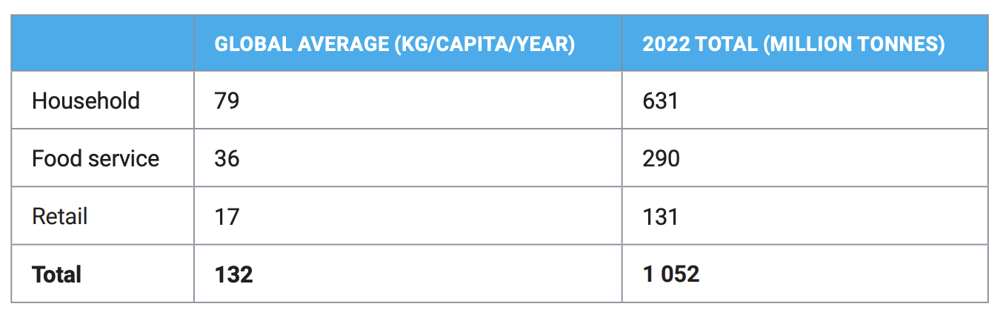
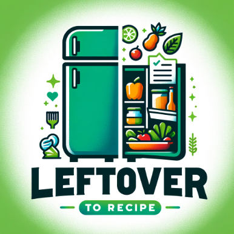
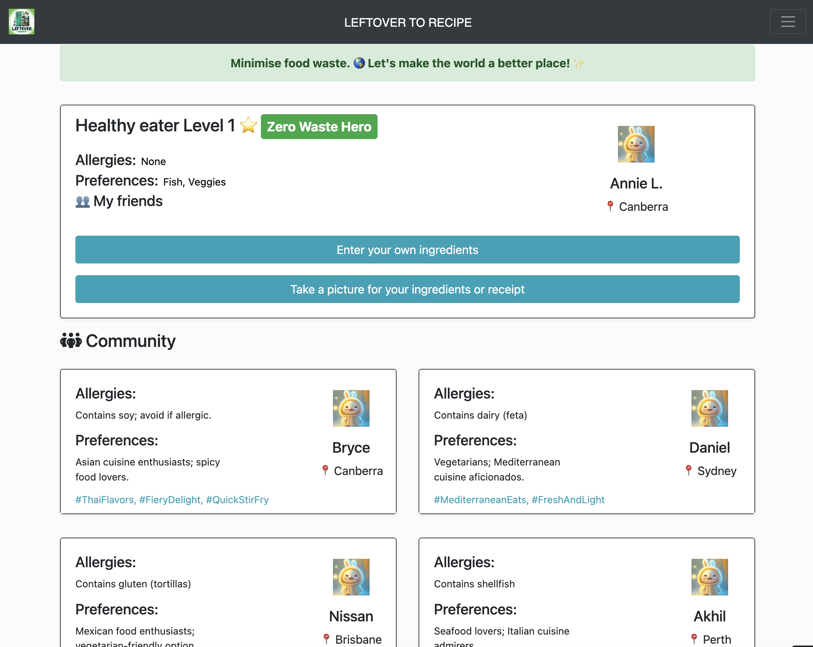

<p align="center">
  🍉 🫒 🥕 🌽 🌶️ 🫑 🥒 🥬 🥦 🧄 🧅 &nbsp;&nbsp;⮕⮕&nbsp;&nbsp;🍜 🍲 🥘 🍛 🥗
</p>

<h2>
    <p align="center">
      Leftover to Recipe
      <br />
      Build Together AI Hackathon 2024 - Building for a Better World
    </p>
</h2>

> 📢 **Turn your leftover ingredients into delectable meals, minimize food waste, and simplify meal decisions with Leftover to Recipe, your ultimate kitchen companion! -- Leftover to Recipe Team**


## Background
**According to [United Nations News](https://news.un.org/en/story/2024/03/1148036#:~:text=UNEP%20report%20reveals.-,With%20783%20million%20people%20going%20hungry%2C%20a%20fifth,all%20food%20goes%20to%20waste&text=While%20a%20third%20of%20humanity,of%20food%20is%20thrown%20away.), with 783 million people going hungry globally, an equivalent of one billion meals are wasted every day. According to the [UN Environment Programme’s Food Waste Index Report 2024](https://wedocs.unep.org/handle/20.500.11822/45230), 1.05 billion tonnes of food are wasted annually. This waste occurs across retail, food service, and household. Most of the world’s food waste comes from households, totalling 631 million tonnes.**

<p align="center">
  
  <br />
  <span style="color: grey;"><i>Source: Food Waste Index Report 2024, UN Environment Programme, 
  <a href="https://wedocs.unep.org/handle/20.500.11822/45230">https://wedocs.unep.org/handle/20.500.11822/45230</a></i>
  </span>
</p>

Our project is dedicated to tackling the issue of households food waste while empowering individuals to manage their food consumption efficiently. By leveraging AI technology, we aim to create a sustainable solution that benefits both people and the environment.

## Project Description

### Purposes
Our project is designed with a dual purpose: to reduce food waste and help individuals keep track of the food they consume and have in their inventory. By utilising AI image recognition and data management, our app offers a comprehensive solution for smarter food management.

### Logo
<p align="center">
  
  <br />
  <span style="color: grey;"><i>Our Logo</i></span>
</p>

### Live demo

🔗 **[leftover-to-recipe.vercel.app](https://leftover-to-recipe.vercel.app)** *(update this link once deployed — see the "Deploy" section below)*

The public demo is a fully working instance, capped at **5 AI calls per IP per day** per step (photo → ingredients, ingredients → recipes) to keep API costs bounded. Once the daily limit is hit, the app shows a friendly "demo limit reached, try again tomorrow" message instead of erroring.

> The project's original Heroku deployment (from the 2024 hackathon) and the QR code that pointed to it are retired — the app has since moved from PHP/Symfony on Heroku/Fly.io to this React + Vercel stack.

### Demo video

Use `Command + Click`(in MacOS) or `Ctrl + Click`(in Linux and Windows) to open and watch this video in a new page. *(Recorded against the original PHP/Symfony version — the UI has stayed the same, only the stack underneath changed.)*

[](https://www.loom.com/share/2de3bbc5607249a69c222a95f3721988?sid=86a9a667-85fe-412f-ab26-2463c5b45285 "Demo video")

## 🌎 How does this make the world better?
- **1. Environmental Impact:**
  - Reduces the carbon footprint associated with food waste.
  - Promotes sustainable living practices.

- **2. Economic Savings:**
  - Helps users save money by optimizing food usage.
  - Reduces the need to purchase additional groceries unnecessarily.

- **3. Health and Well-being:**
  - Provides many meal options for users they may not have expected.
  - Encourages healthy eating habits.
  - Provides balanced and nutritious meal options.

By addressing the critical issue of food waste and promoting efficient food management, our project aims to build a better, more sustainable world. We believe that with the right tools and awareness, we can make a significant impact on both individual lives and the environment.

## Current Features:

- **1. AI-Powered Food Recognition:**
  - Users can take images of the food items they have.

- **2. Recipe Generation:**
  - Based on the identified food items, the app generates a variety of recipes.
  - Recipes are tailored to utilize the available ingredients, ensuring minimal waste.

## Upcoming Features:

- **1. Meal Planning Assistance:**
  - The app suggests meal plans based on the user's food inventory.
  - Customized plans ensure a balanced diet and efficient use of resources.

- **2. Food Inventory Management:**
  - The app keeps an up-to-date inventory of the user's food items.
  - Users can easily track what food they have left and what they have consumed.

- **3. Expiration Date Alerts:**
  - Approaching expiration dates can be shown.
  - Helps prevent food from spoiling and reduces unnecessary waste.

- **4. Sustainability Insights:**
  - Users can view statistics on how much food waste they have prevented.
  - The app provides tips on sustainable food practices.

- **5. Community Sharing:** *(the UI is done)*
  - Users can share excess food items with the community.
  - Promotes a sharing economy and reduces overall food waste.
  - Users can share there status and recipe.

- **6. Nutritional Information:**
  - The app provides detailed nutritional information for each food item and recipe.
  - Users can make informed decisions about their diet.

## Technical stack: What is it & how to run this app in local?

### 1. What is in the stack?

- **Frontend**: [React](https://react.dev/) + [Vite](https://vitejs.dev/), styled with Bootstrap 5 (same UI as the original build).
- **Backend**: two [Vercel serverless functions](https://vercel.com/docs/functions) (`/api/ingredients`, `/api/recipes`) that proxy the OpenAI API — this keeps the API key server-side and is where the daily rate limit is enforced.
- **Rate limiting**: [Upstash Redis](https://vercel.com/marketplace/upstash) (via Vercel Marketplace), 5 calls per IP per day per endpoint.
- **Hosting**: [Vercel](https://vercel.com/).

> The app previously ran on Symfony (PHP) — see git history before this rewrite if you need to reference that version.

### 2. How to run this app in your local?

First of all, you need an [OpenAI API key](https://platform.openai.com/) 🔒.
👉 [How to apply for an OpenAI API key?](https://www.maisieai.com/help/how-to-get-an-openai-api-key-for-chatgpt)

Steps:

- Step 1: Install [Node.js](https://nodejs.org/) 18+ and the [Vercel CLI](https://vercel.com/docs/cli): `npm i -g vercel`
- Step 2: Install dependencies
```bash
npm install          # installs the /api function dependencies (@vercel/kv)
cd web && npm install # installs the React app dependencies
cd ..
```
- Step 3: Set your OpenAI key locally (**⚠️ never commit this — `.env`/`.env.local` are already gitignored**). Use plain `.env` — for this no-framework project, `vercel dev` only auto-loads that one, not `.env.local`.
```bash
echo "OPENAI_API_KEY=sk-..." > .env
```
- Step 4: Run the app with `vercel dev`, which serves the React app *and* the `/api` functions together on one port (rate-limiting falls back to an in-memory counter locally when no Redis store is linked, which is fine for local testing)
```bash
vercel dev

# Result
> Ready! Available at http://localhost:3000
```
- Step 5: Visit `http://localhost:3000` to see the project

### 3. Deploy

1. Import this repo into a new [Vercel](https://vercel.com/new) project (it auto-detects `vercel.json`).
2. Project → **Storage** (or **Integrations → Marketplace**) → add an **Upstash Redis** database → connect it to the project (this injects the `KV_REST_API_URL`/`KV_REST_API_TOKEN` or `UPSTASH_REDIS_REST_URL`/`UPSTASH_REDIS_REST_TOKEN` env vars the rate limiter needs).
3. Project → **Settings → Environment Variables** → add `OPENAI_API_KEY`.
4. Deploy — Vercel gives you a live `*.vercel.app` URL.


